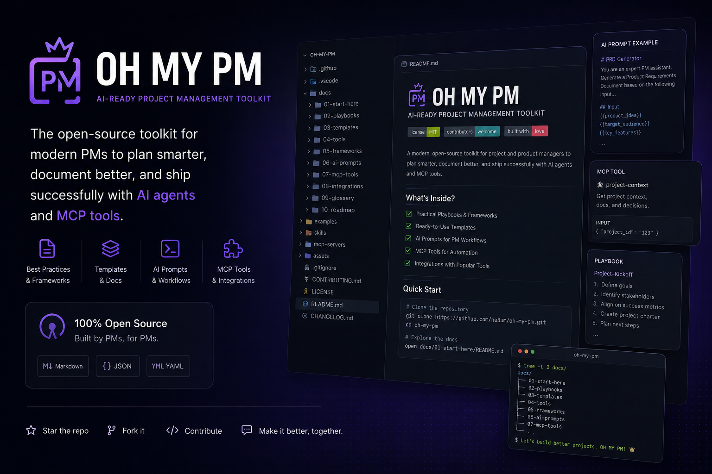

# OH MY PM

**OH MY PM** is a local project intelligence system for structured project and product delivery.
<p align="center">
  
</p>
It is designed for teams that want clearer delivery context, safer execution boundaries, and repeatable validation around project work.

> **Latest stable release:** [`v0.3.1`](https://github.com/he8um/oh-my-pm/releases/tag/v0.3.1)
> **Latest prerelease:** [`v0.3.0-rc.1`](https://github.com/he8um/oh-my-pm/releases/tag/v0.3.0-rc.1)
> **Source version:** `0.4.0` (prepared, not yet published)
>
> The source is prepared for **`v0.4.0`**, which adds one capability — **Project Timeline**: a local, bounded, deterministic history of project changes derived read-only from already-captured Project Brain snapshots, exposed through `oh-my-pm memory timeline` and the `project_timeline` MCP tool. It adds no schema change, no store-format change, no migration, no write path, and no registry publication. See the [v0.4.0 release notes](docs/releases/v0.4.0.md) and the [v0.4 architecture](docs/v0.4/README.md).
>
> [`v0.3.1`](https://github.com/he8um/oh-my-pm/releases/tag/v0.3.1) is the latest **stable** release — a non-draft, non-prerelease GitHub Release marked latest, carrying exactly three assets. It is a CLI usability patch over `v0.3.0` (conventional `--help`, installed `mcp-config`) with no schema, store-format, or MCP capability change. [`v0.3.0`](https://github.com/he8um/oh-my-pm/releases/tag/v0.3.0) remains a preserved immutable stable release targeting `0d6f9b1…`. [`v0.3.0-rc.1`](https://github.com/he8um/oh-my-pm/releases/tag/v0.3.0-rc.1) is a published **prerelease** (the v0.3 Project Brain line; not marked latest), targeting `1db4057…`. [`v0.2.0`](https://github.com/he8um/oh-my-pm/releases/tag/v0.2.0), [`v0.2.0-rc.1`](https://github.com/he8um/oh-my-pm/releases/tag/v0.2.0-rc.1) and [`v0.1.0`](https://github.com/he8um/oh-my-pm/releases/tag/v0.1.0) remain preserved historical releases. Node.js 20+ is the only runtime requirement for installed archives. Packages remain private; there is no npm package.

---

## What this repository is

This repository contains the new v2 line of OH MY PM.

The previous v1 line is maintained separately as a legacy reference. This repository is a clean rebuild with a new architecture and release line.

---

## Product direction

OH MY PM focuses on one practical delivery problem:

> Given a project, what should be done next, what context matters, what boundaries apply, and how should the result be validated?

The project is local-first, validation-first, and designed to keep project execution explicit instead of relying on scattered notes, undocumented assumptions, or manual coordination.

---

## Architecture

The planned architecture is organized around these parts:

| Area | Responsibility |
| --- | --- |
| Kernel | Pure control plane for validation, state, feature flags, and update safety |
| Runtime | Request orchestration and execution flow |
| Planner | Task planning and dependency shaping |
| Context Providers | Read-only project context integrations |
| Skills | Deterministic project-management transformations |
| CLI | User-facing command surface |
| Installer | Local installation and update lifecycle |
| Validation | Structure, boundary, fixture, and release checks |
| Release Lifecycle | Controlled release state transitions |

See [`docs/architecture.md`](docs/architecture.md).

---

## First usable local workflow

After building the workspace, OH MY PM can read Markdown documents from a local project directory and generate a project status brief, a project risk report, a next-task list, or a full project handoff:

```bash
node cli/bin/oh-my-pm.mjs brief ./examples/fixtures/markdown-project --markdown
node cli/bin/oh-my-pm.mjs risks ./examples/fixtures/markdown-project --markdown
node cli/bin/oh-my-pm.mjs next ./examples/fixtures/markdown-project --markdown
node cli/bin/oh-my-pm.mjs handoff ./examples/fixtures/markdown-project --markdown
```

`brief` gives a local project overview from document-level project status. `risks` reports deterministic, line-level risk signals from recognized Markdown risk headings and explicit markers (English and Persian) — each risk is the actual risk line, never a document-title collapse. `next` derives next tasks from unchecked Markdown checklists, list items under recognized action headings, and explicit action markers, stripping any priority marker. `handoff` assembles a project's objective, active work, open tasks, risks, milestones, and decisions from deterministic Markdown sections into a titled handoff with a fixed Summary / Open Tasks / Risks / Decisions layout. Every workflow is read-only and local-only: no context is uploaded, no project file is modified, and no external integration or LLM is required.

Risk and next-task extraction is deterministic and rule-based — no LLM, embedding, or fuzzy scorer. It reads exact English and Persian headings/markers, excludes checked (resolved) items and fenced code, and applies false-positive guards (for example `unblocked` is not `blocked`). The same extraction runs over GitHub issues and pull requests through the `github` command, using exact label and status rules, overdue inference, and one risk/task per item. See [the deterministic extraction guide](docs/deterministic-extraction.md).

## GitHub read-only workflows

The same four workflows can run against a GitHub repository through the explicit
`github` command. This is the one part of OH MY PM that reaches the network, and
only when you invoke it:

```bash
# Public repository (no token needed):
oh-my-pm github brief owner/repository --markdown

# Private repository or higher rate limit:
export OH_MY_PM_GITHUB_TOKEN="<fine-grained read-only token>"
oh-my-pm github brief owner/private-repository --limit 50 --markdown
```

The GitHub provider is strictly read-only: `GET`-only requests to a fixed origin
(`api.github.com`, REST API version `2026-03-10`) for repository metadata, issues,
and pull requests. It never writes to GitHub, never uses a token CLI argument,
and never prints or persists the optional `OH_MY_PM_GITHUB_TOKEN`. See
[the GitHub provider guide](docs/providers/github.md).

`--source` selects exactly which context is analyzed — `overview` (default),
`repository`, `issues`, `pull-requests`, one `item` by `--number`, or a
repository-scoped `search` by `--query` — with `--state open|closed|all` and
search `--kind`. The `item` source can optionally include a single issue/PR's
ordinary conversation comments with `--include-comments` (opt-in, disabled by
default) and `--comment-limit`; see
[GitHub item comments](docs/providers/github-item-comments.md). A pull-request
`item` can additionally include bounded review submissions
(`--include-reviews` / `--review-limit`) and inline review comments
(`--include-review-comments` / `--review-comment-limit`), disabled by default
and only when the selected item is a pull request; see
[GitHub pull-request reviews](docs/providers/github-pr-reviews.md). See also
[GitHub source selection](docs/providers/github-source-selection.md):

```bash
oh-my-pm github risks owner/repository --source issues --state open --markdown
oh-my-pm github brief owner/repository --source item --number 123 --markdown
oh-my-pm github risks owner/repository --source item --number 123 --include-comments --comment-limit 20 --markdown
oh-my-pm github risks owner/repository --source item --number 123 --include-reviews --review-limit 10 --include-review-comments --review-comment-limit 10 --markdown
oh-my-pm github risks owner/repository --source search --query "release blocker" --markdown
```

Scope at a glance:

```text
Local Markdown workflows:
- offline
- no network
- no token

GitHub workflows:
- explicit `github` command/tool only
- outbound read-only HTTPS to api.github.com
- optional token
```

The current next-task workflow extracts explicit unchecked Markdown checklist items. It does not generate tasks from arbitrary prose.

## Getting started locally

The packages are private and repository-based (there is no registry package), and the latest stable release is [`v0.3.1`](https://github.com/he8um/oh-my-pm/releases/tag/v0.3.1). To build from a checkout, see [the getting-started guide](docs/getting-started.md) for the full walkthrough. The short path is:

```bash
rustup target add wasm32-unknown-unknown
pnpm install
pnpm build
pnpm local:install -- --prefix "$HOME/.local"          # preview, writes nothing
pnpm local:install -- --prefix "$HOME/.local" --apply  # writes four shims under <prefix>/bin
pnpm local:check -- --prefix "$HOME/.local"            # read-only verification
```

Once `<prefix>/bin` is on your PATH, the installed CLI exposes the four read-only project workflows:

```bash
oh-my-pm brief ./project --markdown
oh-my-pm risks ./project --markdown
oh-my-pm next ./project --markdown
oh-my-pm handoff ./project --markdown
```

Run `oh-my-pm --help` for the full command reference, or `oh-my-pm <namespace> --help` for a namespace.

MCP onboarding needs no manual path: the installed CLI prints a ready client configuration with `oh-my-pm mcp-config` (add `--markdown` for a documented block, `--name <name>` for a custom server key). From a repository checkout use `pnpm mcp:config -- --prefix "$HOME/.local" --markdown`, which takes an explicit prefix. The installer is preview-first and never edits your PATH, shell profiles, or MCP client configuration. This is the repository build of the `0.3.1` source line (published as the latest stable release `v0.3.1`); installed release archives require only Node.js 20+.

### Historical stable release (v0.2.0)

The [`v0.2.0` release](https://github.com/he8um/oh-my-pm/releases/tag/v0.2.0) — now superseded as latest stable by [`v0.3.1`](https://github.com/he8um/oh-my-pm/releases/tag/v0.3.1) — ships three assets:

```text
oh-my-pm-v0.2.0.tar.gz
oh-my-pm-v0.2.0.zip
oh-my-pm-v0.2.0-SHA256SUMS.txt
```

Stable archive users need only Node.js 20+ (no Rust or pnpm). Download, verify the checksums, extract, then use the preview-first installer (see [Self-installation from a v0.2 bundle](#self-installation-from-a-v02-bundle)) — see [the v0.2.0 release notes](docs/releases/v0.2.0.md). The earlier [`v0.1.0` release](docs/releases/v0.1.0.md) remains available as a preserved historical stable.

### Portable release bundle (development)

A maintainer can assemble a self-contained, versioned bundle from `main` that runs on Node.js 20+ with no Rust, pnpm, or repository checkout. The bundle name is derived from the canonical version in `version.json` (currently `0.2.0`):

```bash
pnpm build
pnpm release:bundle -- --output .release --apply   # writes .release/oh-my-pm-v0.2.0/
node .release/oh-my-pm-v0.2.0/bin/oh-my-pm.mjs status
node .release/oh-my-pm-v0.2.0/bin/oh-my-pm-mcp.mjs
```

The bundle contains the compiled packages, the real Rust/WASM Kernel, the four CLI workflows, the twelve read-only MCP tools, deterministic `RELEASE.json` metadata, and `SHA256SUMS`. This is the development-build path; the published stable `v0.2.0` release provides the same artifact shape and is the recommended install target for users.

### Deterministic release archives

The verified bundle can be packaged into two byte-reproducible archives plus a checksum file:

```bash
pnpm release:archives -- --bundle .release/oh-my-pm-v0.2.0 --output .release --apply
pnpm release:archives:check -- --assets .release
pnpm release:archives:repro -- --bundle .release/oh-my-pm-v0.2.0
```

Both archives expand to a single `oh-my-pm-v<version>/` directory and re-pass the bundle verifier. The `v0.1.0` GitHub Release was published through the manually gated `Release v0.1` workflow; `v0.2.0-rc.1` was published as a prerelease through `Release v0.2 RC`; the stable `v0.2.0` release was published through `Release v0.2 Stable` — see [the stable publishing guide](docs/releases/publishing-v0.2.0.md) and [the post-stable closure report](docs/releases/v0.2.0-post-stable-closure.md).

### Self-installation from a v0.2 bundle

Every portable `0.2.0` bundle ships a preview-first installer at `bin/oh-my-pm-install.mjs`. Download and verify the archive, extract it, preview the installation, then apply it into an explicit prefix:

```bash
# Verify checksums first (both archives):
sha256sum --check oh-my-pm-v0.2.0-SHA256SUMS.txt

tar -xzf oh-my-pm-v0.2.0.tar.gz
# or: unzip oh-my-pm-v0.2.0.zip

# Preview writes nothing.
node ./oh-my-pm-v0.2.0/bin/oh-my-pm-install.mjs --prefix "$HOME/.local"

# Apply installs a versioned, source-independent copy under the prefix.
node ./oh-my-pm-v0.2.0/bin/oh-my-pm-install.mjs --prefix "$HOME/.local" --apply

# Add the prefix bin to PATH yourself — the installer never edits it.
export PATH="$HOME/.local/bin:$PATH"

oh-my-pm status
oh-my-pm brief ./project --markdown
# GitHub opt-in (read-only, network only when invoked):
oh-my-pm github brief owner/repository --markdown
# Installed stdio MCP server (absolute command, ten tools):
"$HOME/.local/bin/oh-my-pm-mcp"
```

Installation is preview-first and requires an explicit `--prefix`; `--apply` is required for any write, and `--force` replaces only the exact managed targets (it is not a version-policy engine). The installer never downloads anything, never edits your PATH, shell profiles, or MCP client configuration, and never writes to project files. After a successful apply the installation is independent of the extracted bundle — you may move or delete the archive and extraction directory, and the installed commands (and the whole prefix, if relocated) keep working. The optional `OH_MY_PM_GITHUB_TOKEN` stays environment-only. This is the recommended install path for the published stable `v0.2.0` release; the earlier `v0.1.0` stable is manual extraction (its immutable archive predates this installer).

## Local project configuration

Each project may define an optional `oh-my-pm.config.json` file at its root.

The configuration controls which Markdown documents are analyzed and may lower the default file and byte limits. It cannot raise safety limits, enable writes, execute code, load environment variables, or access files outside the selected project root.

```json
{
  "version": 1,
  "documents": {
    "include": [
      "README.md",
      "docs/**/*.md"
    ],
    "exclude": [
      "docs/archive/**",
      "docs/drafts/**"
    ],
    "maxFiles": 100,
    "maxBytesPerFile": 131072,
    "maxTotalBytes": 1048576
  }
}
```

Document selection follows a fixed precedence:

```text
include match → exclude check → safety limits → read-only analysis
```

- exclude rules win over include rules
- hard ignored directories (for example `.git` and `node_modules`) cannot be re-enabled
- only `<project-root>/oh-my-pm.config.json` is read; there is no upward config search
- configuration is JSON only and is optional — an absent config preserves current behavior
- an invalid config blocks the workflow with exit code `2` before any analysis
- all four workflows — `brief`, `risks`, `next`, and `handoff` — use the same resolved document set

Supported glob operators are `*` (zero or more non-slash characters), `?` (exactly one non-slash character), and `**` (across path segments, including zero). Matching is case-sensitive; the Markdown extension gate itself remains case-insensitive.

## MCP server

OH MY PM exposes its workflows over a read-only MCP stdio server with exactly
**twelve** tools and **zero** write tools — four local (filesystem-only), four
GitHub (read-only network), two provider diagnostics, and two Project Brain
memory tools:

Local project tools (offline, require a local `root`):

- `project_brief`
- `project_risks`
- `project_next`
- `project_handoff`

GitHub tools (read-only outbound request to `api.github.com` only when called;
`repository`, `limit`, and the source-selection fields — `source`, `state`,
`number`, `query`, `kind` — are optional and fall back to the configured
`providers.json` defaults):

- `github_project_brief`
- `github_project_risks`
- `github_project_next`
- `github_project_handoff`

Provider diagnostics tools:

- `provider_status` — offline resolved provider state; reports token presence only
- `github_provider_diagnostics` — offline GitHub diagnostics; one read-only `GET` only when `confirmNetwork` is set

Project Brain memory tools (offline; read already-captured local memory, need no
project root, write nothing, and perform no network request):

- `project_changes` — compare the two most recent committed snapshots in
  authoritative capture order
- `project_timeline` — a bounded, deterministic history of project changes
  derived from adjacent committed snapshots, filterable by category and item kind
  and paginated by capture

No MCP tool writes a project file or application state, and the transport is
stdio only.

Provider configuration (`providers.json`) is optional, strictly read-only, and
never stores a secret; see [provider configuration](docs/providers/configuration.md)
and [provider diagnostics](docs/providers/diagnostics.md).

After building the workspace, start the server with:

```bash
node mcp-server/bin/oh-my-pm-mcp.mjs
```

The local tools respect `oh-my-pm.config.json` and stay filesystem-local. The
GitHub tools perform read-only outbound API requests only when invoked; server
startup and `tools/list` make no network request. Supply the optional
`OH_MY_PM_GITHUB_TOKEN` to the server process environment when needed — the MCP
client-config generator never inserts secrets. The server never modifies files,
never uploads local project context, uses no telemetry, and exposes no HTTP
endpoint.

For an installed release, use the installed server's **absolute** command with
empty `args` (this is the recommended form for release users):

```json
{
  "mcpServers": {
    "oh-my-pm": {
      "command": "/absolute/path/to/prefix/bin/oh-my-pm-mcp",
      "args": []
    }
  }
}
```

Replace the placeholder with your installed `<prefix>/bin/oh-my-pm-mcp` path. The
optional `OH_MY_PM_GITHUB_TOKEN` is supplied only through the server process
environment, never inside this configuration. For a repository build, run the
server directly instead:

```json
{
  "mcpServers": {
    "oh-my-pm": {
      "command": "node",
      "args": [
        "/absolute/path/to/oh-my-pm/mcp-server/bin/oh-my-pm-mcp.mjs"
      ]
    }
  }
}
```

---

## Current phase

The repository scaffold, shared contracts, Kernel foundation, Runtime foundation, CLI status/doctor/plan foundation, provider framework foundation, Planner foundation, Skills foundation, Runtime plan execution shell, package-level examples, private CLI wrapper, real WASM Kernel binding, Installer foundation, installer filesystem planning, read-only Node filesystem adapter, controlled installer execution, installer examples, CLI installer preview, release package manifest design, local package assembly dry-run, archive plan design, signed release metadata design, release integrity verification design, release channel metadata design, local update policy evaluation design, update impact preview design, rollback impact preview design, installer decision report design, installer audit event model design, installer audit trail export plan design, guarded installer write capability design, explicit write approval token design, explicit write execution plan design, write execution confirmation checklist design, controlled write adapter contract hardening, controlled write execution dry-run envelope design, installer release readiness summary design, v0 release candidate checklist design, public v0 release notes draft design, guarded release artifact planning, guarded local artifact assembly dry-run envelope design, guarded artifact creation permission model, local artifact creation execution plan design, local artifact creation adapter contract design, and local artifact creation confirmation checklist design are in place.

The first user-facing v0.1 vertical slice is now focused on local Markdown project briefs. Installer and release safety foundations remain in place, but new work is prioritizing usable project workflows over additional release abstraction.

Implementation will begin with:

1. repository scaffold
2. shared contracts package
3. Kernel and runtime foundation
4. CLI foundation
5. read-only context provider framework
6. validation and release lifecycle

See [`docs/roadmap.md`](docs/roadmap.md).

---

## Security model

The intended security posture is:

- local-first by default
- no telemetry by default
- no secrets in repository files, logs, issues, examples, or fixtures
- read-only external context integrations
- explicit user-controlled setup for any external connection

See [`docs/security-model.md`](docs/security-model.md) and [`SECURITY.md`](SECURITY.md).

---

## Contributing

This repository is early-stage. Public contributions should focus on documentation, architecture, security, and narrowly scoped implementation work once the scaffold is in place.

Read [`CONTRIBUTING.md`](CONTRIBUTING.md) before opening an issue or pull request.

---

## License

MIT © 2026 AmirHesam Piri
