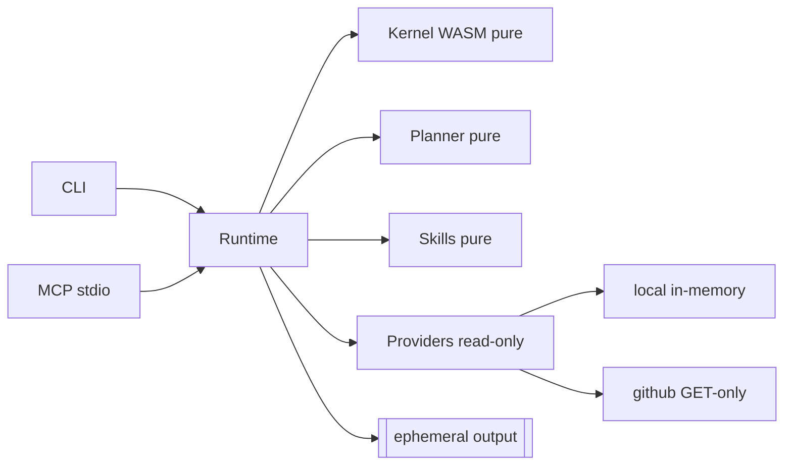
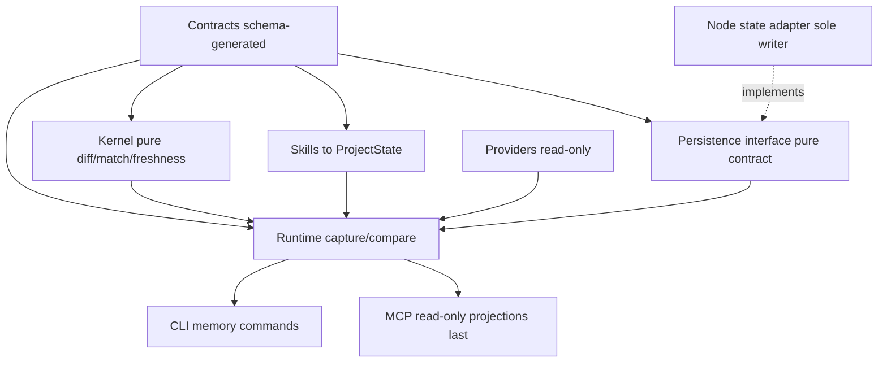
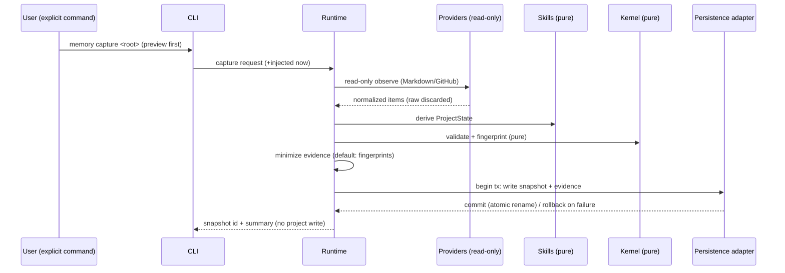
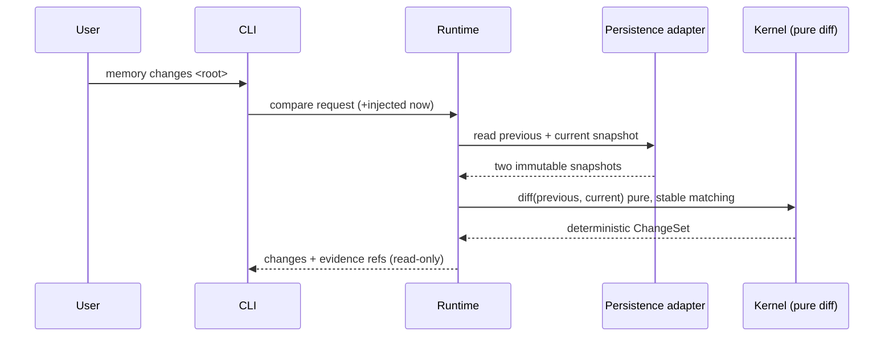
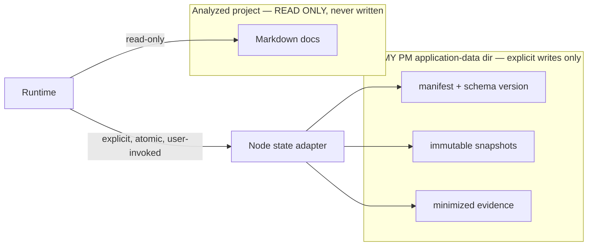

# v0.3 Architecture — Project Brain

This document places the Project Brain inside the existing layer boundaries,
evaluates persistence options, decides package placement, and gives the capture,
compare, and persistence flows as diagrams. It is planning only.

## Design constraints (inherited, non-negotiable)

- The kernel stays pure: no filesystem, network, environment, clock, or
  randomness.
- Providers stay read-only acquisition only.
- Skills stay pure and deterministic with an injected clock.
- The runtime stays the orchestration seam; it is where dependency injection and
  any transaction boundary live.
- Contracts stay JSON-schema-generated to TS and Rust.
- All persistence sits behind an explicit interface, exactly as the installer's
  filesystem access already does.

## Responsibility placement

| Layer | v0.3 responsibility |
|---|---|
| **Kernel** | Pure, deterministic validation, normalization, stable matching, diffing, and freshness rules. The change engine's logic lives here as pure functions (JSON-in/JSON-out), reusing the existing WASM-export style. No persistence. |
| **Contracts** | The six new versioned schemas, generated to TS and Rust. On-disk schema version is a first-class contract field. |
| **Providers** | Unchanged — read-only source acquisition only. No provider learns about memory. |
| **Skills** | PM-domain interpretation and deterministic classification into canonical `ProjectState` (extending the existing extraction). |
| **Runtime** | Capture and compare orchestration, dependency injection of the persistence adapter, and the single transaction boundary for a capture. |
| **Persistence adapter** | Local application-state I/O behind an explicit interface: create schema, read/write snapshots and evidence, export, delete, integrity-check. The **only** component that writes application state. |
| **CLI** | Explicit `memory` commands with preview/confirmation UX and structured output. |
| **MCP** | Read-only projections over captured/derived state — added last, sanitized, and bounded. |

The division mirrors what already exists: the **kernel** is pure logic, the
**installer** already demonstrates "all filesystem mutation behind one explicit,
root-confined adapter." The persistence adapter is the state-layer analogue of
that installer adapter.

## Package placement decision

Options considered:

| Option | Verdict |
|---|---|
| `packages/project-memory` (new) | Possible, but the repo does not use a `packages/` root; new top-level packages are heavily gated by the structure validator. |
| new top-level `storage` package | Rejected — a package for naming symmetry, not need. |
| runtime-local adapter (adapter interface in runtime, Node impl alongside) | **Recommended.** The adapter *interface* is a pure contract the runtime injects; the Node implementation is a small, explicit boundary module, exactly like the CLI's single read-only `node-project-documents.ts` and the installer's single `node-write-filesystem.ts`. |
| state adapter folded into an existing package | Acceptable fallback if the interface proves trivial. |

**Decision:** introduce the persistence *interface* as a pure contract consumed
by the runtime, with a single explicit Node adapter module as the sole writer — no
new package **unless** Phase 2 proves the boundary needs its own package for
dependency hygiene. The interface budget allows **≤ 1** new package; it is spent
only if audit-proven necessary, never for symmetry.

## Persistence options evaluation

| Criterion | SQLite | JSON / JSONL | Embedded KV | Caller-managed (no built-in persistence) |
|---|:--:|:--:|:--:|:--:|
| Cross-platform | 4 (native/WASM caveats) | 5 | 3 | 5 |
| Transaction safety | 5 | 3 (needs care) | 4 | 2 |
| Schema migration | 5 | 3 | 3 | 2 |
| Queryability | 5 | 2 | 3 | 1 |
| Backup / export | 4 | 5 | 3 | 5 |
| Corruption recovery | 4 | 4 | 3 | 3 |
| Dependency cost | 2 | 5 | 3 | 5 |
| Native-dependency risk | 2 | 5 | 3 | 5 |
| Node compatibility | 3 | 5 | 4 | 5 |
| Testability | 4 | 5 | 4 | 4 |
| Release-packaging impact | 2 | 5 | 3 | 5 |
| **Total** | **40** | **47** | **36** | **42** |

### Reasoning against auto-selecting SQLite

SQLite is the strongest *database*, but the product's release model is its
binding constraint: installed archives require **only Node.js 20+**, the whole
runtime tree has just two third-party dependencies (`@modelcontextprotocol/sdk`,
`zod`), and the deterministic-reproducible-archive pipeline is a first-class
gate. A native SQLite dependency risks per-platform binaries and breaks the
"Node 20+, nothing else" promise; a WASM SQLite adds bundle weight and its own
packaging surface. Neither is justified by the first Project Brain slice, whose
query needs are modest (latest snapshot, previous snapshot, evidence by id).

### Recommended default (to be justified in Phase 2, not adopted here)

**Append-oriented JSON/JSONL under the application-data directory**, behind the
persistence interface, with:

- a small **manifest** file (schema version, snapshot index) and per-snapshot
  records;
- **atomic writes** via write-to-temp-then-rename (the pattern the installer
  already uses for transactional safety);
- **integrity fingerprints** per record and a manifest checksum;
- a documented **migration table** keyed by schema version;
- **export** = copy the directory tree; **delete** = remove the directory tree —
  both trivial because the format is plain files.

This keeps the zero-native-dependency, Node-20-only, reproducible-archive
guarantees intact while meeting every acceptance gate. If a future phase proves a
real query need (e.g. large history), the persistence *interface* lets a SQLite
adapter be added behind it without touching callers — but that is a later,
separate decision, and **no dependency is added in this discovery**.

The evaluation is recorded so the choice is deliberate; the binding decision for
the format is made at Phase 2 with the interface already in place.

## Application-data location

Following the existing config-resolution precedent (which already resolves
`$XDG_CONFIG_HOME` / `~/.config` / `%APPDATA%` and only ever *reads*), the state
directory uses the parallel **data** location, never the project:

1. explicit `--data-dir` (or `OH_MY_PM_DATA_DIR`) when supplied;
2. POSIX: `$XDG_DATA_HOME/oh-my-pm/` else `~/.local/share/oh-my-pm/`;
3. Windows: `%LOCALAPPDATA%\oh-my-pm\`.

The stored, user-facing display path is a **non-absolute token**, matching the
config loader's rule. State is never written inside the analyzed project.

## Diagrams

### Current architecture (v0.2, stateless)

### Proposed dependency direction (v0.3)

Dependency arrows point toward contracts and the kernel; the persistence
implementation depends on the interface, never the reverse. Providers never
depend on memory.

### Capture flow

### Compare flow

### Persistence boundary

The boundary is the whole point: the project is read-only; the application-data
directory is the only place any write lands, and only on an explicit mutating
command.

## Concurrency

A single-writer model with a lightweight lock file in the data directory (stale-
lock detection by pid + mtime) serializes captures for one project. Reads
(`changes`, `history`, `status`) never take the write lock. Two different
projects never contend (separate keys). This is sufficient for a local, single-
user tool and adds no daemon.

## Backward compatibility

A v0.3 installation reads ordinary v0.2 project directories with no setup: memory
is optional, project files are unchanged, and every existing command, provider,
and MCP tool behaves identically. Absence of a data directory simply means "no
prior observation yet," which the capture/compare commands handle explicitly.
